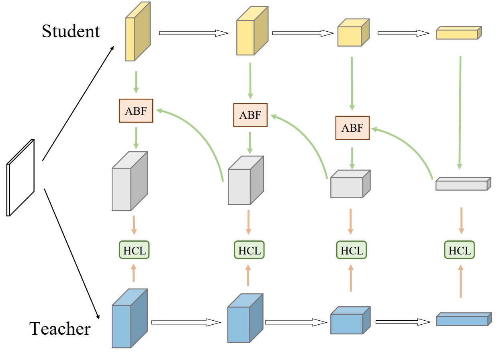

# ML Reproducibility Challenge 2021: Fall Edition

### Submission for [Distilling Knowledge via Knowledge Review](https://arxiv.org/abs/2104.09044) published in CVPR 2021

<center></center>

---

This effort aims to reproduce the results of experiments and analyse the robustness of the review framework for knowledge distillation introduced in the original paper. We verify the improvement in test accuracy of consistently across student models as reported and study the effectiveness of the novel modules introduced by the authors by conducting ablation studies and new experiments.

---

### Setting up environment

```bash
conda create -n reviewkd python=3.8
conda activate reviewkd

git clone https://github.com/DevPranjal/ml-repro-2021.git
cd ml-repro-2021

pip install requirements.txt
```

### Training baseline teachers

To train the teacher model, we use the code written by the authors as follows:

```bash
git clone https://github.com/dvlab-research/ReviewKD
cd ReviewKD/CIFAR100
python train.py --model resnet56
```

### Training student via review mechanism

To train the student model, we have designed `params.py` for all the settings that can be tuned. After setting the desired values for each key, run the following within the `ml-repro-2021` directory

```bash
python train.py
```

### Performing ablation studies and experiments

The ablation studies and experiments have been organized and implemented in `experimental/`. To execute any of them, run the following command:

```bash
cd experimental
python table7_experiments.py
```

### Reproduction Results

#### Classification results when student and teacher have architectures of the same style

| Student               | ResNet20 | ResNet32  | ReNet8x4  | WRN16-2 | WRN40-1 |
| --------------------- | -------- | --------- | --------- | ------- | ------- |
| Teacher               | ResNet56 | ResNet110 | ReNet32x4 | WRN40-2 | WRN40-2 |
| Review KD (Paper)     | 71.89    | 73.89     | 75.63     | 76.12   | 75.09   |
| Review KD (Ours)      | 71.79    | 73.61     | 76.02     | 76.27   | 75.21   |
| Review KD Loss Weight | 0.7      | 1.0       | 5.0       | 5.0     | 5.0     |

#### Classification results when student and teacher have architectures of different styles

| Student               | ShuffleNetV1 | ShuffleNetV1 | ShuffleNetV2 |
| --------------------- | ------------ | ------------ | ------------ |
| Teacher               | ResNet32x4   | WRN40-2      | ReNet32x4    |
| Review KD (Paper)     | 77.45        | 77.14        | 77.78        |
| Review KD (Ours)      | 76.94        | 77.44        | 77.86        |
| Review KD Loss Weight | 5.0          | 5.0          | 8.0          |

#### Adding architectural components one by one

RM - Review Mechanism

RLF - Residual Learning Framework

ABF - Attention Based Fusion

HCL - Hierarchical Context Loss

| RM  | RLF | ABF | HCL | Test Accuracy |
| --- | --- | --- | --- | ------------- |
|     |     |     |     | 69.50         |
| Y   |     |     |     | 69.53         |
| Y   | Y   |     |     | 69.92         |
| Y   | Y   | Y   |     | 71.28         |
| Y   | Y   |     | Y   | 71.51         |
| Y   | Y   | Y   | Y   | 71.79         |
